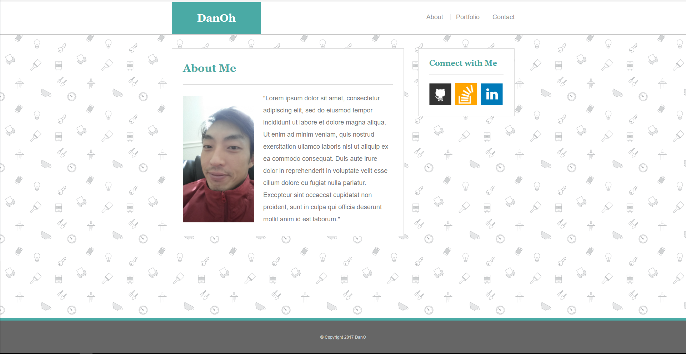

# Basic Portfolio (vanilla HTML/CSS)

## Overview

Personal homepage using only HTML and CSS (without the help of libraries).

Responsive pages using  `@media only screen and (max-width:)`. (`@ 980px 768px 640px`)

Created own container and other components to have consistent layouts throughout site.

## Copyright

DanO  © 2017 All Rights Reserved.

